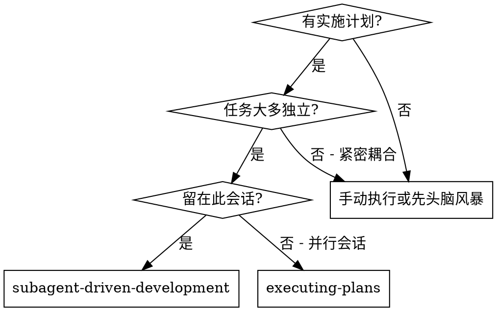
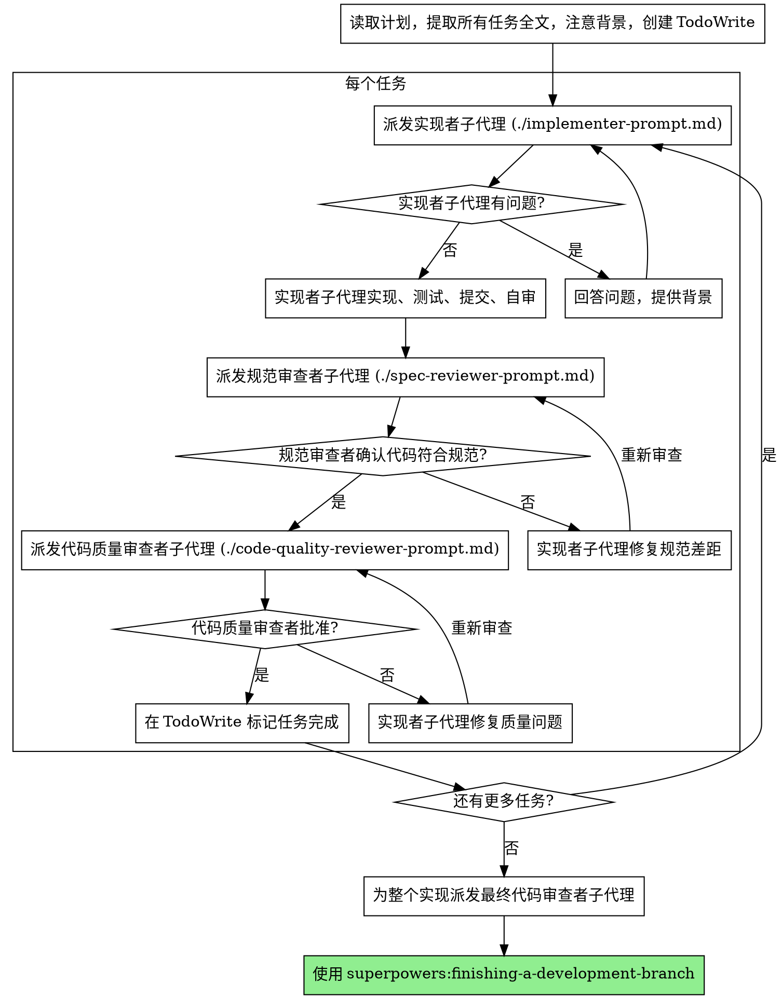

# 子代理驱动开发

通过每个任务派发新子代理执行计划，每个任务后进行两阶段审查：先规范符合性审查，然后代码质量审查。

**核心原则：** 每个任务新子代理 + 两阶段审查（先规范再质量）= 高质量，快速迭代

## 何时使用



**对比 执行计划（并行会话）：**
- 同一会话（无上下文切换）
- 每个任务新子代理（无上下文污染）
- 每个任务后两阶段审查：先规范符合性，再代码质量
- 更快迭代（任务间无人工干预）

## 流程



## 提示模板

- `./implementer-prompt.md` - 派发实现者子代理
- `./spec-reviewer-prompt.md` - 派发规范符合性审查者子代理
- `./code-quality-reviewer-prompt.md` - 派发代码质量审查者子代理

## 示例工作流

```
你：我正在使用子代理驱动开发执行此计划。

[读取计划文件一次：docs/plans/feature-plan.md]
[提取所有 5 个任务全文和背景]
[创建包含所有任务的 TodoWrite]

任务 1：Hook 安装脚本

[获取任务 1 文本和背景（已提取）]
[用完整任务文本 + 背景派发实现子代理]

实现者："开始前 - hook 应该安装在用户级还是系统级？"

你："用户级（~/.config/superpowers/hooks/）"

实现者："明白了。现在实现..."
[稍后] 实现者：
  - 实现了 install-hook 命令
  - 添加了测试，5/5 通过
  - 自审：发现我漏了 --force 标志，添加了它
  - 提交了

[派发规范符合性审查者]
规范审查者：✅ 规范符合 - 所有需求满足，没有额外

[获取 git SHA，派发代码质量审查者]
代码审查者：优势：好的测试覆盖，干净。问题：无。批准。

[标记任务 1 完成]

任务 2：恢复模式

[获取任务 2 文本和背景（已提取）]
[用完整任务文本 + 背景派发实现子代理]

实现者：[没有问题，继续]
实现者：
  - 添加了 verify/repair 模式
  - 8/8 测试通过
  - 自审：一切良好
  - 提交了

[派发规范符合性审查者]
规范审查者：❌ 问题：
  - 缺失：进度报告（规范说"每 100 项报告"）
  - 额外：添加了 --json 标志（未请求）

[实现者修复问题]
实现者：删除了 --json 标志，添加了进度报告

[规范审查者再次审查]
规范审查者：✅ 现在规范符合

[派发代码质量审查者]
代码审查者：优势：扎实。问题（重要）：魔术数字（100）

[实现者修复]
实现者：提取了 PROGRESS_INTERVAL 常量

[代码审查者再次审查]
代码审查者：✅ 批准

[标记任务 2 完成]

...

[所有任务后]
[派发最终代码审查者]
最终审查者：所有需求满足，准备合并

完成！
```

## 优势

**对比 手动执行：**
- 子代理自然遵循 TDD
- 每个任务新背景（无混乱）
- 并行安全（子代理不干扰）
- 子代理可以提问（工作前和工作期间）

**对比 执行计划：**
- 同一会话（无交接）
- 持续进度（无等待）
| 自动审查检查点

**效率提升：**
- 无文件读取开销（控制器提供全文）
- 控制器精确筛选所需背景
- 子代理预先获得完整信息
- 工作开始前就发现问题（不是之后）

**质量关卡：**
- 自审在交接前捕获问题
- 两阶段审查：规范符合性，然后代码质量
- 审查循环确保修复实际有效
- 规范符合性防止过度/不足构建
- 代码质量确保实现构建良好

**成本：**
- 更多子代理调用（每个任务实现者 + 2 个审查者）
- 控制器做更多准备工作（预先提取所有任务）
- 审查循环增加迭代
- 但早期捕获问题（比之后调试更便宜）

## 危险信号

**永远不要：**
- 没有用户明确同意在 main/master 分支开始实现
- 跳过审查（规范符合性或代码质量）
- 未修复问题继续
- 并行派发多个实现子代理（冲突）
- 让子代理读取计划文件（改为提供全文）
- 跳过场景设定背景（子代理需要理解任务定位）
- 忽略子代理问题（让他们继续前回答）
- 规范符合性接受"足够接近"（规范审查者发现问题 = 未完成）
- 跳过审查循环（审查者发现问题 = 实现者修复 = 再次审查）
- 让实现者自审替代实际审查（两者都需要）
- **规范符合性 ✅ 之前开始代码质量审查**（错误顺序）
- 任一审查有未解决问题时移到下一个任务

**如果子代理有问题：**
- 清晰完整回答
- 如果需要提供额外背景
- 不要催促他们进入实现

**如果审查者发现问题：**
- 实现者（同一子代理）修复它们
- 审查者再次审查
- 重复直到批准
- 不要跳过重新审查

**如果子代理任务失败：**
- 用具体指令派发修复子代理
- 不要尝试手动修复（背景污染）

## 集成

**必需工作流技能：**
- **superpowers:using-git-worktrees** - 必需：开始前设置隔离工作区
- **superpowers:writing-plans** - 创建此技能执行的计划
- **superpowers:requesting-code-review** - 审查者子代理的代码审查模板
- **superpowers:finishing-a-development-branch** - 所有任务后完成开发

**子代理应使用：**
- **superpowers:test-driven-development** - 子代理对每个任务遵循 TDD

**替代工作流：**
- **superpowers:executing-plans** - 用于并行会话而非同会话执行