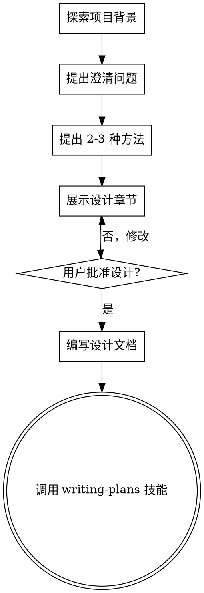

# 头脑风暴：从想法到设计

## 概述

通过自然的协作对话，帮助将想法转化为完整的设计和规范。

首先了解当前项目背景，然后逐一提问来完善想法。一旦理解了要构建的内容，展示设计并获得用户批准。

<HARD-GATE>
在展示设计并获得用户批准之前，不要调用任何实现技能、编写任何代码、搭建任何项目或采取任何实现行动。这适用于每个项目，无论看起来多么简单。
</HARD-GATE>

## 反模式："这太简单了不需要设计"

每个项目都要经过这个流程。一个待办列表、一个单函数工具、一个配置更改——所有这些。"简单"项目正是未经验证的假设导致最多浪费工作的地方。设计可以很短（对于真正简单的项目只需几句话），但你必须展示它并获得批准。

## 检查清单

你必须为以下每项创建任务并按顺序完成：

1. **探索项目背景** — 检查文件、文档、最近提交
2. **提出澄清问题** — 一次一个，理解目的/约束/成功标准
3. **提出 2-3 种方法** — 包含权衡和你的建议
4. **展示设计** — 按复杂度分节展示，每节后获得用户批准
5. **编写设计文档** — 保存到 `docs/plans/YYYY-MM-DD-<topic>-design.md` 并提交
6. **过渡到实现** — 调用 writing-plans 技能创建实现计划

## 流程图

**终止状态是调用 writing-plans。** 不要调用 frontend-design、mcp-builder 或任何其他实现技能。头脑风暴后唯一调用的技能是 writing-plans。

## 流程

**理解想法：**
- 首先检查当前项目状态（文件、文档、最近提交）
- 一次问一个问题来完善想法
- 尽可能使用多选题，但开放式问题也可以
- 每条消息只问一个问题 - 如果某个主题需要更多探索，分解成多个问题
- 专注于理解：目的、约束、成功标准

**探索方法：**
- 提出 2-3 种不同的方法及其权衡
- 以对话方式展示选项，包含你的建议和理由
- 首先展示你推荐的选项并解释原因

**展示设计：**
- 一旦你认为理解了要构建的内容，展示设计
- 每节的篇幅按复杂度调整：简单几句话，复杂最多 200-300 字
- 每节后询问是否正确
- 涵盖：架构、组件、数据流、错误处理、测试
- 准备好回去澄清不清楚的地方

## 设计之后

**文档化：**
- 将验证过的设计写入 `docs/plans/YYYY-MM-DD-<topic>-design.md`
- 如果可用，使用 elements-of-style:writing-clearly-and-concisely 技能
- 将设计文档提交到 git

**实现：**
- 调用 writing-plans 技能创建详细的实现计划
- 不要调用任何其他技能。writing-plans 是下一步。

## 关键原则

- **一次一个问题** - 不要用多个问题压倒对方
- **优先多选题** - 比开放式问题更容易回答
- **严格 YAGNI** - 从所有设计中删除不必要的功能
- **探索替代方案** - 在确定之前总是提出 2-3 种方法
- **增量验证** - 展示设计，在继续之前获得批准
- **保持灵活** - 当某些事情不清楚时回去澄清