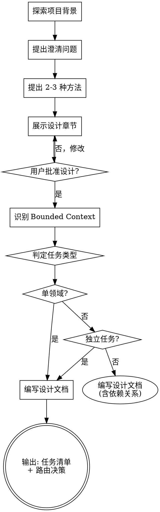

# 头脑风暴：从想法到设计

## 概述

通过自然的协作对话，帮助将想法转化为完整的设计和规范，并识别任务类型以路由到正确的执行方式。

首先了解当前项目背景，然后逐一提问来完善想法。一旦理解了要构建的内容，展示设计并获得用户批准。

<HARD-GATE>
在展示设计并获得用户批准之前，不要调用任何实现技能、编写任何代码、搭建任何项目或采取任何实现行动。这适用于每个项目，无论看起来多么简单。
</HARD-GATE>

## 检查清单

你必须为以下每项创建任务并按顺序完成：

1. **探索项目背景** — 检查文件、文档、最近提交
2. **提出澄清问题** — 一次一个，理解目的/约束/成功标准
3. **提出 2-3 种方法** — 包含权衡和你的建议
4. **展示设计** — 按复杂度分节展示，每节后获得用户批准
5. **识别涉及的 Bounded Context** — 判断涉及哪些领域
6. **判定任务类型** — 单领域/多领域独立/多领域有依赖
7. **编写设计文档** — 保存到 `docs/plans/YYYY-MM-DD-<topic>-design.md` 并提交

## 流程图



## 领域识别映射

根据项目 DDD 架构，识别涉及以下 Bounded Context：

| Context | 负责领域 | 对应 Subagent |
|---------|----------|---------------|
| **User** | 用户、学生、老师、家长、权限 | `ai-edu-coder-user` |
| **Question** | 题库、知识点、难度分级 | `ai-edu-coder-question` |
| **Homework** | 作业提交、AI批改、评分统计 | `ai-edu-coder-homework` |
| **Learning** | 错题本、知识掌握度、情绪识别 | `ai-edu-coder-learning` |
| **Organization** | 组织架构、升阶规则 | `ai-edu-coder-organization` |
| **Frontend** | Thymeleaf模板、页面交互 | `ai-edu-front-ssr` |
| **Testing** | 全栈测试 | `ai-edu-tester` |

## 任务类型判定

### 类型 A：单领域任务

**判定条件：**
- 仅涉及一个 Bounded Context
- 不需要其他领域的接口支持

**执行方式：** 直接派发给对应的 subagent

```
示例：添加用户头像上传功能
→ 仅涉及 User Context
→ 直接派发给 ai-edu-coder-user
```

### 类型 B：多领域独立任务

**判定条件：**
- 涉及多个 Bounded Context
- 各任务之间无依赖关系，可并行执行

**执行方式：** 使用 `dispatching-parallel-agents` 并行派发

```
示例：同时开发"题库管理"和"用户注册"功能
→ Question Context + User Context
→ 两个功能独立，可并行
→ 并行派发给 ai-edu-coder-question 和 ai-edu-coder-user
```

### 类型 C：多领域有依赖任务

**判定条件：**
- 涉及多个 Bounded Context
- 任务之间有先后依赖关系

**执行方式：** 通过 `ai-edu-architect-coordinator` 协调

```
示例：开发作业批改功能
→ Homework Context 依赖 Question Context（获取题目信息）
→ 依赖 Learning Context（更新错题本）
→ 需要架构师定义接口契约，协调开发顺序
```

## 设计文档输出格式

```markdown
# [功能名称] 设计文档

## 1. 需求概述
[简要描述功能需求]

## 2. 设计方案
[架构设计、组件设计、数据流]

## 3. Bounded Context 分析

### 涉及的领域
| Context | 涉及内容 | 负责人 Agent |
|---------|----------|--------------|
| User | 用户认证 | ai-edu-coder-user |
| Homework | 作业提交 | ai-edu-coder-homework |

### 依赖关系图
```
User Context
    │
    ▼
Homework Context ──► Learning Context
```

## 4. 任务拆分与路由

### 任务类型
- [x] 类型 C：多领域有依赖任务

### 任务清单
| 序号 | 任务 | Context | Agent | 依赖 |
|------|------|---------|-------|------|
| 1 | 用户认证接口 | User | ai-edu-coder-user | - |
| 2 | 作业提交接口 | Homework | ai-edu-coder-homework | 1 |
| 3 | 错题本更新 | Learning | ai-edu-coder-learning | 2 |

### 执行建议
- 任务1 完成后，并行启动任务2
- 任务2 完成后，启动任务3
- 需要架构师先输出 User→Homework 接口契约

## 5. 接口契约需求
[列出需要架构师定义的跨领域接口]

## 6. 验收标准
[功能验收标准]
```

## 流程

**理解想法：**
- 首先检查当前项目状态（文件、文档、最近提交）
- 一次问一个问题来完善想法
- 专注于理解：目的、约束、成功标准

**探索方法：**
- 提出 2-3 种不同的方法及其权衡
- 以对话方式展示选项，包含你的建议和理由

**展示设计：**
- 一旦你认为理解了要构建的内容，展示设计
- 每节的篇幅按复杂度调整
- 涵盖：架构、组件、数据流、错误处理、测试

**领域识别与任务分类：**
- 识别涉及的 Bounded Context
- 判断任务类型（A/B/C）
- 输出任务清单和路由决策

## 设计之后

**文档化：**
- 将验证过的设计写入 `docs/plans/YYYY-MM-DD-<topic>-design.md`
- 包含领域分析和任务路由决策
- 将设计文档提交到 git

**执行路由：**

| 任务类型 | 下一步操作 |
|----------|------------|
| 类型 A (单领域) | 直接调用对应 subagent，提供设计文档和任务描述 |
| 类型 B (多领域独立) | 调用 `dispatching-parallel-agents` skill |
| 类型 C (多领域有依赖) | 调用 `ai-edu-architect-coordinator` agent |

## 关键原则

- **一次一个问题** - 不要用多个问题压倒对方
- **严格 YAGNI** - 从所有设计中删除不必要的功能
- **增量验证** - 展示设计，在继续之前获得批准
- **明确领域边界** - 清晰识别涉及的 Bounded Context
- **正确路由** - 根据任务类型选择正确的执行方式