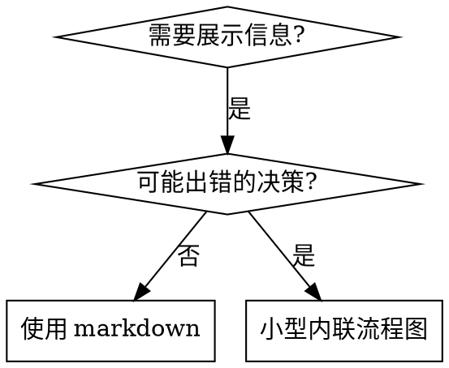

# 编写技能

## 概述

**编写技能就是应用于流程文档的测试驱动开发。**

**个人技能位于代理特定目录（Claude Code 为 `~/.claude/skills`，Codex 为 `~/.agents/skills/`）**

你编写测试用例（带子代理的压力场景），看它们失败（基线行为），编写技能（文档），看测试通过（代理符合），并重构（关闭漏洞）。

**核心原则：** 如果你没有看到代理在没有技能时失败，你不知道技能是否教授正确的东西。

**必需背景：** 你必须在使用此技能前理解 superpowers:test-driven-development。该技能定义了基本的红-绿-重构循环。此技能将 TDD 适配到文档。

**官方指南：** 对于 Anthropic 的官方技能编写最佳实践，参见 anthropic-best-practices.md。本文档提供了补充此技能中 TDD 聚焦方法的额外模式和指南。

## 什么是技能？

**技能**是经过验证的技术、模式或工具的参考指南。技能帮助未来的 Claude 实例找到并应用有效方法。

**技能是：** 可重用技术、模式、工具、参考指南

**技能不是：** 关于你如何一次解决问题的叙述

## 技能的 TDD 映射

| TDD 概念 | 技能创建 |
|-------------|----------------|
| **测试用例** | 带子代理的压力场景 |
| **生产代码** | 技能文档（SKILL.md） |
| **测试失败（红）** | 没有技能时代理违反规则（基线） |
| **测试通过（绿）** | 有技能时代理符合 |
| **重构** | 在保持符合时关闭漏洞 |
| **先写测试** | 写技能前运行基线场景 |
| **看它失败** | 记录代理使用的确切合理化借口 |
| **最小代码** | 编写技能解决那些特定违规 |
| **看它通过** | 验证代理现在符合 |
| **重构循环** | 找到新合理化借口 → 堵住 → 重新验证 |

整个技能创建过程遵循红-绿-重构。

## 何时创建技能

**创建当：**
- 技术对你来说不直观明显
- 你会在项目间再次引用
- 模式广泛适用（非项目特定）
- 其他人会受益

**不要创建：**
- 一次性解决方案
- 其他地方文档完善的标准实践
- 项目特定约定（放在 CLAUDE.md）
- 机械约束（如果可以用正则/验证强制，自动化它——为判断力保留文档）

## 技能类型

### 技术
有步骤可遵循的具体方法（condition-based-waiting, root-cause-tracing）

### 模式
思考问题的方式（flatten-with-flags, test-invariants）

### 参考
API 文档、语法指南、工具文档（office docs）

## 目录结构

```
skills/
  skill-name/
    SKILL.md              # 主要参考（必需）
    supporting-file.*     # 仅在需要时
```

**扁平命名空间** - 所有技能在一个可搜索命名空间

**分离文件用于：**
1. **重型参考**（100+ 行）- API 文档、综合语法
2. **可重用工具** - 脚本、工具、模板

**保持内联：**
- 原则和概念
- 代码模式（< 50 行）
- 其他所有内容

## SKILL.md 结构

**前置元数据（YAML）：**
- 只支持两个字段：`name` 和 `description`
- 总共最多 1024 字符
- `name`：只使用字母、数字和连字符（无括号、特殊字符）
- `description`：第三人称，只描述何时使用（不是做什么）
  - 以"当...时使用"开始聚焦触发条件
  - 包含具体症状、情况和背景
  - **永远不要在描述中总结技能流程或工作流**（见 CSO 部分了解原因）
  - 尽可能保持在 500 字符以内

```markdown
---
name: Skill-Name-With-Hyphens
description: 当 [具体触发条件和症状] 时使用
---

# 技能名称

## 概述
这是什么？1-2 句核心原则。

## 何时使用
[如果决定不明显，小型内联流程图]

带症状和用例的项目符号列表
何时不使用

## 核心模式（用于技术/模式）
前后代码比较

## 快速参考
常用操作扫描表或项目符号

## 实现
简单模式内联代码
重型参考或可重用工具链接到文件

## 常见错误
什么出错 + 修复

## 现实世界影响（可选）
具体结果
```

## Claude 搜索优化（CSO）

**对发现至关重要：** 未来的 Claude 需要找到你的技能

### 1. 丰富的描述字段

**目的：** Claude 读取描述来决定为给定任务加载哪些技能。让它回答："我应该现在读这个技能吗？"

**格式：** 以"当...时使用"开始聚焦触发条件

**关键：描述 = 何时使用，不是技能做什么**

描述应该只描述触发条件。不要在描述中总结技能流程或工作流。

**为什么这很重要：** 测试显示当描述总结技能工作流时，Claude 可能遵循描述而不是读取完整技能内容。描述说"任务间代码审查"导致 Claude 做一次审查，即使技能流程图清楚显示两次审查（先规范符合性再代码质量）。

当描述改为只是"在当前会话中执行带有独立任务的实施计划时使用"（无工作流总结），Claude 正确读取流程图并遵循两阶段审查流程。

**陷阱：** 总结工作流的描述创造了 Claude 会走的捷径。技能主体变成 Claude 跳过的文档。

```yaml
# ❌ 坏：总结工作流 - Claude 可能遵循这个而不是读取技能
description: 执行计划时使用 - 每个任务派发子代理，任务间代码审查

# ❌ 坏：太多流程细节
description: 用于 TDD - 先写测试，看它失败，写最小代码，重构

# ✅ 好：只有触发条件，无工作流总结
description: 在当前会话中执行带有独立任务的实施计划时使用

# ✅ 好：只有触发条件
description: 在实现任何功能或修复 bug 之前使用，在编写实现代码之前
```

**内容：**
- 使用具体触发器、症状和情况来信号此技能适用
- 描述问题（竞态条件、不一致行为）而非语言特定症状（setTimeout、sleep）
- 保持触发器技术无关，除非技能本身是技术特定的
- 如果技能是技术特定的，在触发器中明确
- 用第三人称写（注入到系统提示）
- **永远不要总结技能流程或工作流**

```yaml
# ❌ 坏：太抽象、模糊、不包含何时使用
description: 用于异步测试

# ❌ 坏：第一人称
description: 当测试不稳定时我可以帮你处理异步测试

# ❌ 坏：提及技术但技能不特定于它
description: 当测试使用 setTimeout/sleep 且不稳定时使用

# ✅ 好：以"当...时使用"开始，描述问题，无工作流
description: 当测试有竞态条件、时间依赖或不一致通过/失败时使用

# ✅ 好：技术特定技能带明确触发器
description: 当使用 React Router 并处理认证重定向时使用
```

### 2. 关键词覆盖

使用 Claude 会搜索的词：
- 错误消息："Hook timed out", "ENOTEMPTY", "race condition"
- 症状："flaky", "hanging", "zombie", "pollution"
- 同义词："timeout/hang/freeze", "cleanup/teardown/afterEach"
- 工具：实际命令、库名、文件类型

### 3. 描述性命名

**使用主动语态，动词优先：**
- ✅ `creating-skills` 不是 `skill-creation`
- ✅ `condition-based-waiting` 不是 `async-test-helpers`

### 4. Token 效率（关键）

**问题：** getting-started 和频繁引用技能加载到每次对话。每个 token 都重要。

**目标字数：**
- getting-started 工作流：每个 <150 词
- 频繁加载技能：总共 <200 词
- 其他技能：<500 词（仍要简洁）

**技术：**

**将细节移到工具帮助：**
```bash
# ❌ 坏：在 SKILL.md 中文档所有标志
search-conversations supports --text, --both, --after DATE, --before DATE, --limit N

# ✅ 好：引用 --help
search-conversations 支持多种模式和过滤器。运行 --help 了解详情。
```

**使用交叉引用：**
```markdown
# ❌ 坏：重复工作流细节
搜索时，用模板派发子代理...
[20 行重复指令]

# ✅ 好：引用其他技能
总是使用子代理（50-100x 上下文节省）。必需：用 [other-skill-name] 工作流。
```

**压缩示例：**
```markdown
# ❌ 坏：冗长示例（42 词）
你的合作伙伴："我们在 React Router 中之前如何处理认证错误？"
你：我会搜索过去对话中的 React Router 认证模式。
[派发子代理，搜索查询："React Router authentication error handling 401"]

# ✅ 好：最小示例（20 词）
合作伙伴："我们在 React Router 中如何处理认证错误？"
你：搜索中...
[派发子代理 → 综合]
```

**消除冗余：**
- 不要重复交叉引用技能中的内容
- 不要解释命令明显的内容
- 不要包含相同模式的多个示例

**验证：**
```bash
wc -w skills/path/SKILL.md
# getting-started 工作流：目标 <150 每个
# 其他频繁加载：目标 <200 总共
```

**按你做的事或核心洞察命名：**
- ✅ `condition-based-waiting` > `async-test-helpers`
- ✅ `using-skills` 不是 `skill-usage`
- ✅ `flatten-with-flags` > `data-structure-refactoring`
- ✅ `root-cause-tracing` > `debugging-techniques`

**动名词（-ing）适合流程：**
- `creating-skills`, `testing-skills`, `debugging-with-logs`
- 主动，描述你正在采取的行动

### 4. 交叉引用其他技能

**当编写引用其他技能的文档时：**

只使用技能名称，带明确要求标记：
- ✅ 好：`**必需子技能：** 使用 superpowers:test-driven-development`
- ✅ 好：`**必需背景：** 你必须理解 superpowers:systematic-debugging`
- ❌ 坏：`见 skills/testing/test-driven-development`（不清楚是否必需）
- ❌ 坏：`@skills/testing/test-driven-development/SKILL.md`（强制加载，消耗上下文）

**为什么没有 @ 链接：** `@` 语法立即强制加载文件，在你需要之前消耗 200k+ 上下文。

## 流程图使用



**流程图只用于：**
- 不明显的决策点
- 可能过早停止的流程循环
- "何时使用 A vs B" 决策

**永远不要用流程图：**
- 参考材料 → 表、列表
- 代码示例 → Markdown 块
- 线性指令 → 编号列表
- 无语义意义的标签（step1, helper2）

参见 @graphviz-conventions.dot 了解 graphviz 风格规则。

**为你的合作伙伴可视化：** 使用此目录中的 `render-graphs.js` 将技能流程图渲染为 SVG：
```bash
./render-graphs.js ../some-skill           # 每个图表单独
./render-graphs.js ../some-skill --combine # 所有图表在一个 SVG
```

## 代码示例

**一个优秀示例胜过许多平庸示例**

选择最相关语言：
- 测试技术 → TypeScript/JavaScript
- 系统调试 → Shell/Python
- 数据处理 → Python

**好示例：**
- 完整可运行
- 注释良好解释为什么
- 来自真实场景
- 清晰展示模式
- 准备适配（非通用模板）

**不要：**
- 用 5+ 种语言实现
- 创建填空模板
- 编写人为示例

你擅长移植 - 一个好示例就够了。

## 文件组织

### 自包含技能
```
defense-in-depth/
  SKILL.md    # 所有内容内联
```
当：所有内容适合，无需重型参考

### 带可重用工具的技能
```
condition-based-waiting/
  SKILL.md    # 概述 + 模式
  example.ts  # 可适配的工作辅助
```
当：工具是可重用代码，不只是叙述

### 带重型参考的技能
```
pptx/
  SKILL.md       # 概述 + 工作流
  pptxgenjs.md   # 600 行 API 参考
  ooxml.md       # 500 行 XML 结构
  scripts/       # 可执行工具
```
当：参考材料太大无法内联

## 铁律（同 TDD）

```
没有先失败的测试，就不写技能
```

这适用于新技能和现有技能的编辑。

写技能前测试？删除它。重新开始。
不测试就编辑技能？同样违规。

**没有例外：**
- 不是"简单添加"
- 不是"只是添加一节"
- 不是"文档更新"
- 不要保留未测试更改作为"参考"
- 不要在运行测试时"调整"
- 删除意味着删除

**必需背景：** superpowers:test-driven-development 技能解释为什么这重要。相同原则适用于文档。

## 测试所有技能类型

不同技能类型需要不同测试方法：

### 纪律强制技能（规则/需求）

**示例：** TDD, verification-before-completion, designing-before-coding

**测试用：**
- 学术问题：他们理解规则吗？
- 压力场景：他们在压力下符合吗？
- 组合多个压力：时间 + 沉没成本 + 疲惫
- 识别合理化借口并添加明确反驳

**成功标准：** 代理在最大压力下遵循规则

### 技术技能（如何指南）

**示例：** condition-based-waiting, root-cause-tracing, defensive-programming

**测试用：**
- 应用场景：他们能正确应用技术吗？
- 变化场景：他们处理边缘情况吗？
- 缺失信息测试：指令有差距吗？

**成功标准：** 代理成功将技术应用于新场景

### 模式技能（心智模型）

**示例：** reducing-complexity, information-hiding concepts

**测试用：**
- 识别场景：他们识别何时模式适用吗？
- 应用场景：他们能使用心智模型吗？
- 反例：他们知道何时不应用吗？

**成功标准：** 代理正确识别何时/如何应用模式

### 参考技能（文档/API）

**示例：** API 文档、命令参考、库指南

**测试用：**
- 检索场景：他们能找到正确信息吗？
- 应用场景：他们能正确使用找到的内容吗？
- 差距测试：常见用例覆盖了吗？

**成功标准：** 代理找到并正确应用参考信息

## 跳过测试的常见合理化借口

| 借口 | 现实 |
|--------|---------|
| "技能明显清晰" | 对你清晰 ≠ 对其他代理清晰。测试它。 |
| "只是参考" | 参考可能有差距、不清楚章节。测试检索。 |
| "测试过度" | 未测试技能有问题。总是。15 分钟测试节省小时。 |
| "有问题再测试" | 问题 = 代理无法使用技能。部署前测试。 |
| "测试太乏味" | 测试比在生产中调试坏技能更不无聊。 |
| "我有信心它好" | 过度自信保证问题。无论如何测试。 |
| "学术审查够了" | 阅读 ≠ 使用。测试应用场景。 |
| "没时间测试" | 部署未测试技能浪费更多时间稍后修复。 |

**所有这些都意味着：部署前测试。没有例外。**

## 防弹技能抵抗合理化

强制纪律的技能（如 TDD）需要抵抗合理化。代理很聪明，会在压力下找到漏洞。

**心理学注释：** 理解说服技术为什么有效帮助你系统化应用它们。参见 persuasion-principles.md 了解研究基础（Cialdini, 2021; Meincke et al., 2025）关于权威、承诺、稀缺、社会认同和统一原则。

### 明确关闭每个漏洞

不要只陈述规则 - 禁止特定变通方法：

<坏>
```markdown
测试前写代码？删除它。
```
</坏>

<好>
```markdown
测试前写代码？删除它。重新开始。

**没有例外：**
- 不要保留作为"参考"
- 不要在写测试时"调整"它
- 不要看它
- 删除意味着删除
```
</好>

### 处理"精神 vs 字面"论点

早期添加基础原则：

```markdown
**违反规则的字面意思就是违反规则的精神。**
```

这切断了整类"我在遵循精神"合理化借口。

### 构建合理化表

从基线测试捕获合理化借口（见下文测试部分）。代理找的每个借口进入表格：

```markdown
| 借口 | 现实 |
|--------|---------|
| "太简单不需要测试" | 简单代码也会出错。测试只需 30 秒。 |
| "我会在之后测试" | 立即通过的测试证明不了什么。 |
| "之后的测试达到相同目标" | 之后测试 = "这做什么？"测试优先 = "这应该做什么？" |
```

### 创建危险信号列表

让代理在合理化时容易自我检查：

```markdown
## 危险信号 - 停止并重新开始

- 测试前代码
- "我已经手动测试了"
- "之后的测试达到相同目的"
- "是精神不是仪式"
- "这不同因为..."

**所有这些都意味着：删除代码。用 TDD 重新开始。**
```

### 为违规症状更新 CSO

添加到描述：你即将违反规则时的症状：

```yaml
description: 在实现任何功能或修复 bug 之前使用，在编写实现代码之前
```

## 技能的红-绿-重构

遵循 TDD 循环：

### 红：写失败测试（基线）

在没有技能的情况下用子代理运行压力场景。记录确切行为：
- 他们做了什么选择？
- 他们使用了什么合理化借口（逐字）？
- 哪些压力触发了违规？

这是"看测试失败" - 你必须在编写技能前看到代理自然做什么。

### 绿：写最小技能

编写解决那些特定合理化借口的技能。不要为假设情况添加额外内容。

有技能运行相同场景。代理现在应该符合。

### 重构：关闭漏洞

代理找到了新合理化借口？添加明确反驳。重新测试直到防弹。

**测试方法：** 见 @testing-skills-with-subagents.md 了解完整测试方法：
- 如何编写压力场景
- 压力类型（时间、沉没成本、权威、疲惫）
- 系统化堵漏洞
- 元测试技术

## 反模式

### ❌ 叙述示例
"在会话 2025-10-03，我们发现空 projectDir 导致..."
**为什么坏：** 太具体，不可重用

### ❌ 多语言稀释
example-js.js, example-py.py, example-go.go
**为什么坏：** 平庸质量，维护负担

### ❌ 流程图中的代码
```dot
step1 [label="import fs"];
step2 [label="read file"];
```
**为什么坏：** 无法复制粘贴，难读

### ❌ 通用标签
helper1, helper2, step3, pattern4
**为什么坏：** 标签应该有语义意义

## 停止：移到下一个技能前

**编写任何技能后，你必须停止并完成部署流程。**

**不要：**
- 不测试每个批量创建多个技能
| 当前技能验证前移到下一个
- 因为"批处理更高效"跳过测试

**下面的部署检查清单对每个技能是强制性的。**

部署未测试技能 = 部署未测试代码。这是质量标准违规。

## 技能创建检查清单（TDD 适配）

**重要：使用 TodoWrite 为下面每个检查清单项创建待办。**

**红阶段 - 写失败测试：**
- [ ] 创建压力场景（纪律技能 3+ 组合压力）
- [ ] 没有技能运行场景 - 逐字记录基线行为
- [ ] 识别合理化/失败模式

**绿阶段 - 写最小技能：**
- [ ] 名称只使用字母、数字、连字符（无括号/特殊字符）
- [ ] YAML 前置元数据只有 name 和 description（最多 1024 字符）
- [ ] 描述以"当...时使用"开始并包含具体触发器/症状
- [ ] 描述用第三人称写
- [ ] 全文关键词搜索（错误、症状、工具）
- [ ] 清晰概述带核心原则
- [ ] 解决红阶段识别的特定基线失败
- [ ] 代码内联或链接到单独文件
- [ ] 一个优秀示例（非多语言）
- [ ] 有技能运行场景 - 验证代理现在符合

**重构阶段 - 关闭漏洞：**
- [ ] 从测试识别新合理化借口
- [ ] 添加明确反驳（如果是纪律技能）
- [ ] 从所有测试迭代构建合理化表
- [ ] 创建危险信号列表
- [ ] 重新测试直到防弹

**质量检查：**
- [ ] 只在决定不明显时小型流程图
- [ ] 快速参考表
- [ ] 常见错误章节
- [ ] 无叙述讲故事
- [ ] 支持文件只用于工具或重型参考

**部署：**
- [ ] 将技能提交到 git 并推送到你的分支（如果配置）
- [ ] 考虑通过 PR 贡献回来（如果广泛有用）

## 发现工作流

未来的 Claude 如何找到你的技能：

1. **遇到问题**（"测试不稳定"）
3. **找到技能**（描述匹配）
4. **扫描概述**（这相关吗？）
5. **阅读模式**（快速参考表）
6. **加载示例**（只在实现时）

**为此流程优化** - 早期和经常放置可搜索术语。

## 底线

**创建技能就是应用于流程文档的 TDD。**

相同铁律：没有先失败测试就不写技能。
相同循环：红（基线）→ 绿（写技能）→ 重构（关闭漏洞）。
相同好处：更好质量，更少意外，防弹结果。

如果你为代码遵循 TDD，为技能遵循它。这是应用于文档的相同纪律。